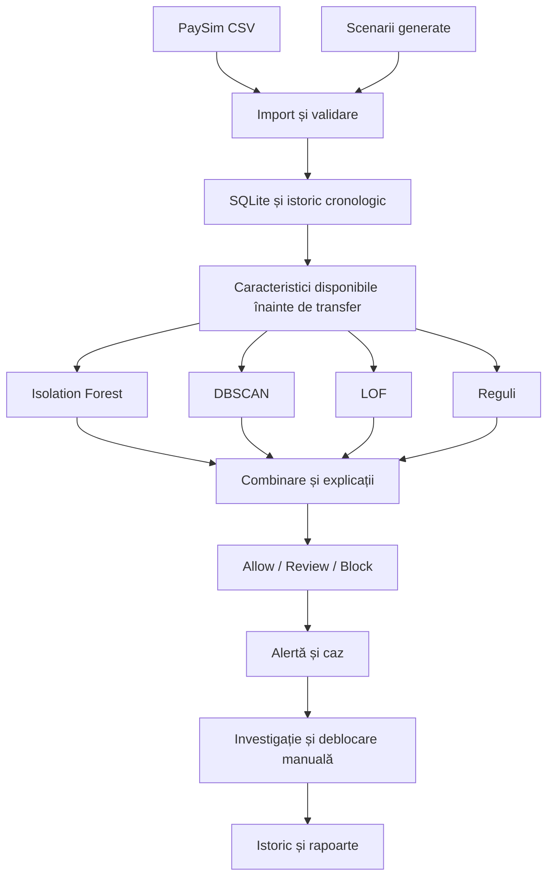

# SecFlow blueprint și roadmap de implementare

Data: 4 octombrie 2026. Document de planificare; platforma urmează să fie implementată.

## 1. Produsul și scopul academic

SecFlow este o aplicație web locală pentru un analist bancar care examinează transferuri instant simulate, identifică tranzacții și conturi suspecte, gestionează cazurile și corectează deciziile automate. Contextul produsului este protecția clienților în plăți de tip MIA. Datele PaySim nu sunt date MIA și nu există integrare cu o bancă reală în această versiune.

Partea centrală pentru cursul Analiza și Proiectarea Algoritmilor este implementarea de la zero a Isolation Forest, DBSCAN și Local Outlier Factor, explicarea lor, analiza complexității și compararea experimentală a rezultatelor. Regulile completează algoritmii; nu îi înlocuiesc.

Livrarea are două etape: platforma funcțională, apoi raportul universitar bazat pe implementare și rezultate reale. Acest blueprint privește prima etapă și păstrarea dovezilor necesare raportului.

## 2. Cerințele stabilite

- Aplicație web locală, cu logică Python și stocare SQLite.
- Interfață în engleză, minimalistă, albă și albastră.
- Cinci pagini principale: Dashboard, Transactions, Fraud Cases, Accounts, Algorithm Results.
- Autentificare cu roluri Admin și Analyst.
- PaySim ca dataset principal și scenarii suplimentare generate.
- Câmpuri simulate pentru dispozitive, autentificări și timp în secunde.
- Analiză prin toți cei trei algoritmi implementați de la zero și reguli explicabile.
- Risk score, explicații, alerte, decizii Allow / Review / Block.
- Blocare automată în simulare și deblocare manuală cu motiv obligatoriu și istoric.
- Rapoarte operaționale exportabile și comparație experimentală a algoritmilor.
- Fără API comercial separat sau integrare bancară pentru versiunea universitară.

## 3. Arhitectura propusă

Python + Django, cu pagini HTML randate pe server, CSS propriu și JavaScript simplu pentru grafice și interacțiuni. Django oferă autentificare, permisiuni, formulare și acces la baza de date în aceeași aplicație. Această alegere simplifică propunerea inițială cu frontend separat și API.

SQLite este baza de date locală; datasetul este sursa datelor, nu înlocuiește stocarea utilizatorilor, deciziilor și investigațiilor. Fișierele CSV brute rămân separate de datele operaționale.



Modulele de algoritmi nu depind de Django. Bibliotecile de infrastructură și operațiile numerice de bază sunt permise; algoritmii de detecție, distanțele, vecinătățile, arborii și formulele sunt implementate în proiect. Nu apelăm implementările gata făcute ale celor trei algoritmi în fluxul produsului.

Structura orientativă:

```text
Secflow/
  BLUEPRINT.md
  README.md
  requirements.txt
  manage.py
  config/                 # configurarea Django
  core/                   # conturi, transferuri, cazuri, roluri, audit
  detection/
    features.py
    preprocessing.py
    isolation_forest.py
    dbscan.py
    lof.py
    rules.py
    scoring.py
    evaluation.py
  datasets/               # import, validare, generare și manifest
  templates/              # paginile produsului
  static/                 # CSS, JavaScript, elemente vizuale
  tests/                  # algoritmi, date și fluxuri critice
  data/raw/               # PaySim original, exclus din Git
  data/generated/         # scenarii reproductibile
  artifacts/              # rezultate, parametri și benchmarkuri
```

## 4. Contractul datelor

### PaySim original

Păstrăm fișierul sursă nemodificat și identificatorul fiecărui rând. Importăm `step`, `type`, `amount`, `nameOrig`, `nameDest`, etichetele și soldurile sursă. Soldurile rămân disponibile doar ca informații istorice din dataset, fără a fi folosite în detecție, conform avertismentului autorului PaySim.

`isFraud` este adevărul de referință pentru evaluare. `isFlaggedFraud` reprezintă o regulă existentă a simulatorului, nu verdictul nostru și nu intră în caracteristicile algoritmilor.

### Extensia SecFlow

| Câmp | Rol |
|---|---|
| `transaction_id` | Identificator stabil și unic. |
| `source_row_id` | Legătura cu rândul original, când există. |
| `timestamp_seconds` | Secunde de la începutul simulării. |
| `device_id` | Dispozitiv simulat, asociat cu istoricul contului expeditor. |
| `is_new_device` | Calculat din istoricul anterior al contului. |
| `login_attempts` | Încercări totale pentru sesiunea simulată. |
| `failed_login_attempts` | Încercări eșuate; între zero și totalul încercărilor. |
| `session_id` | Leagă autentificarea simulată de transfer. |
| `data_origin` | `PaySim` sau `Generated scenario`. |
| `security_metadata_origin` | Marchează explicit metadatele de securitate generate. |
| `timestamp_origin` | Marchează precizia temporală generată. |
| `scenario_type` | Etichetă pentru evaluarea scenariilor generate; exclusă din detecție. |
| `ground_truth_fraud` | Etichetă de evaluare; exclusă din detecție. |

Pentru PaySim, convenția este `timestamp_seconds = (step - 1) * 3600 + offset_seconds`, cu offset între 0 și 3599, generat reproductibil. Ordinea rândurilor din aceeași oră este păstrată prin offseturi nedescrescătoare și identificator ca departajare; timestampurile pot coincide. Nu pretindem că acestea sunt orele exacte originale.

Metadatele de securitate pentru PaySim sunt generate independent de `isFraud`. Nu folosim eticheta ca să atribuim retrospectiv dispozitive suspecte doar fraudelor. Scenariile injectate au etichete și metadate proprii și se evaluează separat.

Importul verifică schema, sumele, valorile lipsă, tipurile, unicitatea și proveniența. Reimportul nu dublează transferurile. Nu amestecăm sau legăm arbitrar identități din dataseturi diferite.

## 5. Scenariile de demonstrație

| Categorie | Scenariu și dovezi |
|---|---|
| Sume neobișnuite | Sumă mult peste istoricul anterior al contului sau peste comportamentul comparabil. |
| Transferuri repetate | Serie de transferuri la câteva secunde distanță și creșterea frecvenței. |
| Fragmentarea sumelor | Mai multe transferuri mici cu valoare cumulată neobișnuită. |
| Account takeover | Dispozitiv nou, încercări eșuate și schimbare a comportamentului transferurilor. |
| Mule account | Încasări de la mai multe conturi și transferarea rapidă a banilor mai departe. |
| Beneficiar nou suspect | Beneficiar necunoscut pentru expeditor, combinat cu alte indicii. |
| Activitate coordonată | Tranzacții similare ca sumă, frecvență și structură de activitate. |
| Scam-related transfer | Transfer atipic către un beneficiar suspect, folosit ca scenariu de investigație. |
| Activitate legitimă atipică | Plată mare legitimă, dispozitiv nou legitim și serie legitimă de plăți, pentru testarea alarmelor false. |

Tipurile reprezintă acoperirea demonstrată a prototipului. O anomalie nu confirmă automat o fraudă, iar un grup DBSCAN nu este automat fraudulos. Pentru scam nu afirmăm că algoritmii deduc conversațiile sau intenția clientului din transferuri.

## 6. Caracteristicile analizate

Construim caracteristici din informațiile disponibile în momentul cererii de transfer și din istoricul anterior:

- suma transformată logaritmic și abaterea față de istoricul contului;
- transferuri inițiate în ultimele 60 de secunde, 5 minute și o oră;
- valoarea cumulată a cererilor în aceste intervale;
- intervalul de la transferul anterior;
- beneficiar nou pentru expeditor și numărul partenerilor anteriori;
- încasări precedente ale beneficiarului și numărul expeditorilor diferiți;
- indicatori de intrări și ieșiri rapide pentru analiza mule;
- dispozitiv nou și numărul încercărilor eșuate.

Caracteristicile care cer secunde precise sunt evaluate ca simulate. Pentru benchmarkul PaySim original folosim timpul la granularitatea sa reală, de o oră, și caracteristici care nu necesită metadate inventate.

Normalizarea se ajustează numai pe setul de referință. Etichetele, proveniența, tipul scenariului, rezultatele blocării și soldurile PaySim nu intră în vectorul analizat. La istoric insuficient folosim un reper global și afișăm această limită în explicație.

## 7. Proiectarea celor trei algoritmi

| Algoritm | Implementare proprie | Rezultat afișat |
|---|---|---|
| Isolation Forest | Sub-eșantionare, arbori cu separări aleatoare, lungimea căilor și normalizarea scorului. | Scor de anomalie și poziția față de prag. |
| DBSCAN | Distanțe, căutare în vecinătate, puncte core/border/noise și extinderea clusterelor. | Cluster, statut noise și caracteristicile grupului. |
| LOF | k-nearest neighbors cu tratarea egalităților, reachability distance, densitate locală și raport LOF. | Scor LOF și comparație cu vecinii. |

DBSCAN va analiza loturi sau ferestre; nu îi inventăm o probabilitate de fraudă. LOF are mod retrospectiv pentru loturi și un mod pentru observații noi care folosește densitățile unui set de referință. Aceste moduri sunt implementate și testate distinct. Isolation Forest poate puncta observații noi după construirea arborilor.

Pentru replay, Isolation Forest și LOF folosesc numai referința disponibilă anterior. DBSCAN folosește o fereastră până la transferul curent; reanaliza retrospectivă este etichetată separat de decizia inițială.

Parametri vizibili: numărul arborilor, dimensiunea sub-eșantionului, seed, `eps`, `min_samples`, `k`, caracteristici și praguri. Fiecare rulare salvează parametrii și versiunea datelor.

Complexități orientative, pentru implementarea inițială:

- Isolation Forest: construcție aproximativ O(t · ψ · log ψ) pentru arbori echilibrați; evaluare aproximativ O(t · log ψ) pe observație. Raportul va trata separat adâncimea maximă și costul împărțirii datelor.
- DBSCAN cu vecinătăți prin scanare: O(n² · d) timp; O(n · d + n) memorie suplimentară dacă vecinătățile nu sunt toate stocate.
- LOF cu distanțe exhaustive și sortarea vecinilor: O(n² · d + n² · log n) timp. Evităm matricea completă de distanțe; stocăm vecinii necesari, cu atenție la egalități.

`n` este numărul observațiilor, `d` numărul caracteristicilor, `t` numărul arborilor și `ψ` dimensiunea sub-eșantionului. Benchmarkurile măsoară implementarea reală și completează analiza teoretică.

## 8. Scorul și deciziile

Transformăm rezultatele celor trei algoritmi pe o scară comparabilă, folosind referința și validarea, apoi le combinăm cu indicatorii regulilor. Formula, ponderile și pragurile rămân vizibile și versionate. Alegerea inițială a ponderilor este o ipoteză de validat, nu o concluzie despre eficiență.

Fiecare evaluare păstrează separat rezultatul fiecărui algoritm, contribuția sa, regulile declanșate și risk score 0–100. Comparația algoritmilor se face și fără reguli, ca să vedem valoarea lor individuală.

- `Allow`: executarea simulată a transferului.
- `Review`: transfer ținut în așteptare și caz creat pentru verificare.
- `Block`: transfer refuzat și alertă creată; politica poate restricționa și contul asociat, cu motiv explicit.

Blocarea transferului și restricția contului folosesc aceeași politică de risc și sunt legate în interfață. Sunt stări distincte în stocare deoarece deblocarea unui cont nu trebuie să execute retroactiv un transfer refuzat.

Deblocarea cere motiv și salvează autorul, ora, starea anterioară și noua stare. Transferul blocat rămâne blocat; o nouă cerere este evaluată separat. O rerulare a analizei păstrează istoricul și nu șterge corecțiile analistului.

Etichetele de risc pentru conturi sunt `Low risk`, `Elevated risk`, `High risk`, împreună cu `Active` sau `Blocked`. Nu afișăm siguranță absolută.

Risk score nu este fraud probability. Probabilitatea estimată devine disponibilă numai dacă implementăm și validăm calibrarea pe date etichetate separate; în lipsa ei afișăm explicit `Not calibrated`.

## 9. Interfața și fluxurile

| Pagină | Funcții obligatorii |
|---|---|
| Dashboard | Transferuri, alerte, conturi blocate, sume, evoluție temporală și cele mai recente cazuri; intervalul și sursa datelor vizibile. |
| Transactions | Căutare, filtre, paginare; detalii cu expeditor, beneficiar, timp, dispozitiv, scoruri, motive și decizie. |
| Fraud Cases | Status Open / Investigating / Resolved, responsabil, note și rezultat Confirmed fraud / False positive / Inconclusive. |
| Accounts | Istoric, parteneri, risc, dispozitive simulate, cazuri asociate și blocare/deblocare cu motiv. |
| Algorithm Results | Parametri, scoruri, clustere, comparație, confusion matrix, metrici și benchmarkuri. |

Login, importul, configurarea și auditul sunt ecrane auxiliare, nu înlocuiesc cele cinci pagini principale. Rapoartele CSV și o pagină imprimabilă se accesează din Dashboard și Algorithm Results. Raportul academic se scrie ulterior.

Admin gestionează utilizatori, importuri și configurarea detecției și poate efectua toate acțiunile analistului. Analyst investighează, adaugă note, rezolvă cazuri și corectează blocări; nu gestionează utilizatori sau parametrii globali. Permisiunile sunt aplicate în backend, nu doar prin ascunderea butoanelor.

Design: fundal alb, navigare albastră, spațiere aerisită, tabele lizibile, culori moderate pentru risc. Stările au și text; nu depind numai de culoare. Filtrele, încărcarea, erorile și rezultatele goale primesc mesaje clare în engleză.

## 10. Modelul datelor operaționale

| Entitate | Date principale |
|---|---|
| User și Role | Autentificare și permisiuni Admin / Analyst. |
| DatasetImport | Sursă, checksum, seed, schema, număr de rânduri, validare. |
| Account | Identificator, risc, stare și istoricul restricțiilor. |
| Transaction | Expeditor, beneficiar, sumă, tip, timp, proveniență și metadate. |
| DetectionRun | Versiuni, referință, parametri, durată și mod de analiză. |
| TransactionAssessment | Rezultatele algoritmilor, reguli, risc și decizie pentru o rulare. |
| FraudCase și CaseNote | Transferuri asociate, responsabil, stare, rezultat și observații. |
| AuditEvent | Actor, acțiune, obiect, motiv, moment și modificarea stării. |

Un transfer poate avea mai multe evaluări, fără suprascrierea deciziei inițiale. Conturile pot apărea ca expeditori și beneficiari în mai multe transferuri. Cazurile agregă alerte asociate pentru a evita duplicarea investigațiilor.

## 11. Evaluarea și demonstrarea impactului

Împărțim datele cronologic în referință/antrenare, validare și test final. Nu construim istoricul sau normalizarea folosind transferuri viitoare. Pragurile se aleg pe validare, iar testul final rămâne separat.

Benchmarkul PaySim și scenariile suplimentare au rezultate separate. Pentru rulările locale folosim un subset documentat și reproductibil; mărimea finală se stabilește după măsurători, deoarece DBSCAN și LOF exhaustive nu sunt potrivite pentru întregul CSV în fiecare interacțiune.

Metrici: precision, recall, F1, confusion matrix, rata alarmelor false, durata construirii referinței, durata evaluării și estimarea memoriei. Accuracy singură nu este suficientă pentru date cu fraude rare. Pentru DBSCAN evaluăm explicit regula care transformă noise și informațiile clusterelor în alerte.

Comparații: fiecare algoritm separat, reguli separat, cei trei algoritmi combinați și combinația algoritmi + reguli. Nu garantăm că combinația este mai bună înainte de măsurare.

Impactul simulării: valoarea tentativelor frauduloase blocate, valoarea fraudelor permise, transferuri legitime blocate și alerte trimise spre review. Transferurile în review nu se numără automat ca pierderi prevenite. Vorbim despre impact estimat în simulare, nu despre o reducere demonstrată într-o bancă reală sau o prognoză economică validată.

## 12. Roadmap cu criterii de finalizare

| Etapă | Implementare | Criteriu de finalizare |
|---|---|---|
| 1. Fundația | Structura Django, SQLite, autentificare, roluri și shell alb/albastru. | Aplicația pornește local; ambele roluri au accesul corect. |
| 2. Datele | Import PaySim, manifest, extensie temporală, dispozitive, sesiuni și scenarii. | Import reproductibil, fără duplicate; date originale și generate identificabile. |
| 3. Istoricul | Preprocesare, caracteristici și împărțire cronologică. | Nicio caracteristică nu folosește etichete sau viitorul; scalarea folosește referința. |
| 4. Algoritmii | Isolation Forest, DBSCAN, LOF și teste pe exemple mici cunoscute. | Toate trei produc rezultate verificabile și au parametri salvați. |
| 5. Deciziile | Scor combinat, reguli, Allow / Review / Block și restricții de cont. | Replay complet: transfer → evaluare → decizie → alertă/caz, cu audit. |
| 6. Produsul | Cele cinci pagini cu date reale din baza locală și investigații. | Filtrele, detaliile, notele, rezolvarea și deblocarea funcționează și persistă. |
| 7. Experimentele | Comparații, metrici, benchmarkuri și exporturi. | Rezultatele sunt reproductibile și separate după sursă și algoritm. |
| 8. Pregătirea prezentării | Verificarea vizuală, demonstrație, README și set de date pentru prezentare. | Un coleg poate porni și demonstra produsul după instrucțiuni. |

Ordinea este de dependență. Integrarea algoritmilor se face incremental: fiecare se conectează la flux imediat ce este verificat, apoi se construiește combinația. Calendarul se stabilește după disponibilitatea CSV-ului și primul benchmark; nu există încă un termen de livrare confirmat.

## 13. Verificările necesare

- Exemple mici pentru arbori, clustere cunoscute și densități LOF calculabile manual; inclusiv puncte identice și egalități la distanță.
- Valori lipsă, istoric gol, subset mic și parametri invalizi.
- Import repetat, seed fix și reconstruirea aceleiași demonstrații.
- Verificare că etichetele și datele viitoare nu influențează caracteristicile.
- Acțiuni neautorizate refuzate; motiv obligatoriu la deblocare și audit persistent.
- Cont blocat, transfer nou, review, confirmarea fraudei și rezolvarea unei alarme false.
- Verificarea interfeței în browser: toate cele cinci pagini, filtre, formulare, export și lipsa erorilor vizuale.

## 14. Demonstrația finală

1. Autentificare ca Analyst și prezentarea Dashboard.
2. Transfer obișnuit permis, cu explicații de risc scăzut.
3. Sumă neobișnuită: compararea celor trei rezultate.
4. Serie rapidă și scenariu account takeover: blocare automată și deschiderea cazului.
5. Mule account: vizualizarea încasărilor și ieșirilor rapide.
6. Alarmă falsă: investigare, notă și deblocare manuală cu istoric.
7. Algorithm Results: comparație de eficiență și complexitate empirică.
8. Exportul rezultatelor și prezentarea impactului simulării.

## 15. Definiția platformei finalizate

Platforma este finalizată când toate cele cinci pagini sunt conectate la date persistente, toți cei trei algoritmi proprii sunt folosiți și comparabili, deciziile automate și corecțiile manuale funcționează, scenariile sunt demonstrabile, rezultatele sunt reproductibile și README permite pornirea locală. Capturile, parametrii și metricile sunt păstrate pentru raportul ulterior.

Primul pas de implementare: fundația Django și contractul de import, apoi pregătirea datasetului PaySim local. Nu construim întâi un dashboard cu rezultate fictive ale algoritmilor.

## Surse

- Propunerea utilizatorului: `Secflow_021115.docx` și deciziile stabilite în conversație.
- [PaySim și explicația câmpurilor](https://www.kaggle.com/datasets/ealaxi/paysim1/data).
- [Django arhitectură și pagini randate pe server](https://docs.djangoproject.com/en/5.2/intro/overview/).
- [Django autentificare și permisiuni](https://docs.djangoproject.com/en/5.2/topics/auth/default/).
- [Anomaly detection și diferența dintre outlier și novelty detection](https://scikit-learn.org/stable/modules/outlier_detection.html); referință conceptuală, fără utilizarea implementărilor sale în produs.
